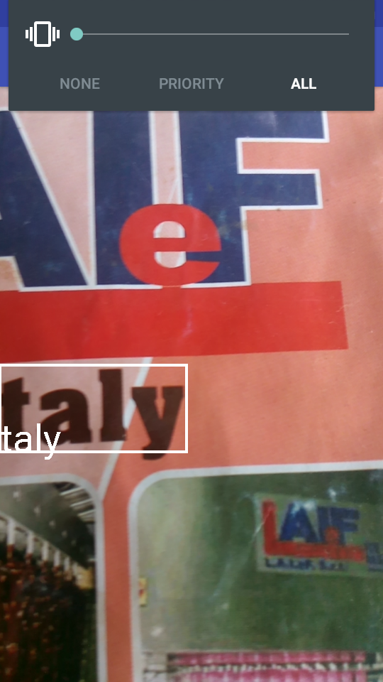
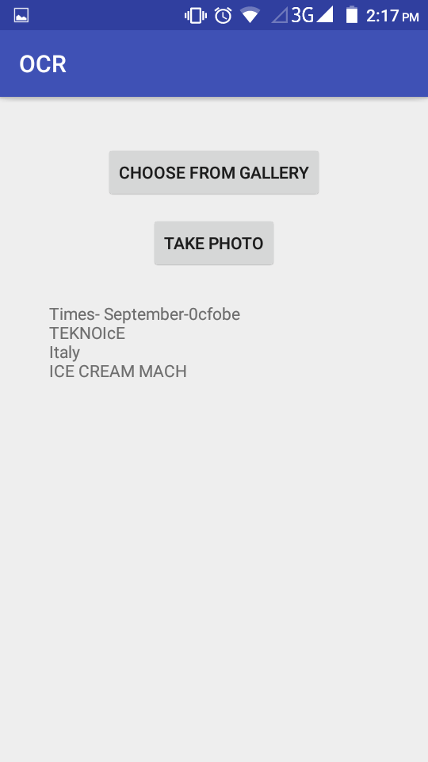

# OCR
  
Text Recognition by Camera using Google Vision

# Features
Optical Character Recognition (OCR) gives a computer the ability to read text that appears in an image,  
letting applications make sense of signs, articles, flyers, pages of text, menus, or any other place that text appears as part of an image. 
 The Mobile Vision Text API gives Android developers a powerful and reliable OCR capability  
 that works with most Android devices and won't increase the size of your app.or scan and pdf or any image 

# TO-DO
Improve the UI  
General QOL changes

# Acknowledgements
In build.gardle file add:-
repositories {
     ..... 
    maven { url "https://maven.google.com" }
}

dependencies {
......
compile 'com.google.android.gms:play-services-vision:11.0.+'
....
}

In AndroidManifest file add Permissions:-

<uses-permission android:name="android.permission.CAMERA" />
    <uses-permission android:name="android.permission.INTERNET" />
    <uses-permission android:name="android.permission.READ_EXTERNAL_STORAGE" />
    <uses-permission android:name="android.permission.WRITE_EXTERNAL_STORAGE" />
    <uses-feature android:name="android.hardware.camera" />
    <uses-permission android:name="android.permission.CAMERA" />
    
     <application
     ......
     ......>
     ...............
     ................
     <meta-data
            android:name="com.google.android.gms.vision.DEPENDENCIES"
            android:value="ocr" />
            
      </application>
     

